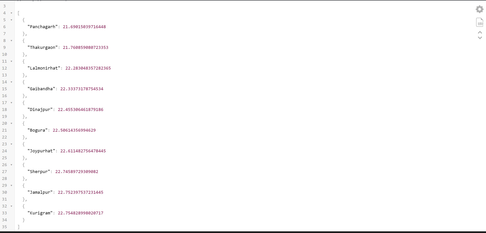

# Cool Districts Weather API

## Overview

The Cool Districts Weather API provides weather information for cool districts, helping users find destinations with pleasant weather to travel to.

## Getting Started

### Prerequisites

- Docker: Ensure that Docker is installed on your machine. If not, you can download it [here](https://www.docker.com/get-started).

### Installation

1. Start the Docker service:

    ```bash
    sudo systemctl start docker
    ```

2. Build the Docker image from the root directory:

    ```bash
    docker build -t coolapi:v0 -f app/Dockerfile .
    ```

3. Start the Docker container:

    ```bash
    docker run -p 80:80 coolapi:v0
    ```
4. Successful response should look like this : 


### Testing

- Open your browser and navigate to [http://localhost:80](http://localhost:80) to test the API.

### API Documentation

- Explore the API documentation by visiting [http://localhost:80/docs](http://localhost:80/docs).

## Troubleshooting

If you encounter any issues:

1. Prune Docker resources:

    ```bash
    sudo docker system prune
    ```

2. If you face the error "failed to solve: python:3.9.0: failed to authorize: failed to fetch anonymous token," restart or start the Docker service:

    ```bash
    sudo systemctl start docker
    # or
    sudo systemctl restart docker
    ```

## Contributing

If you would like to contribute to the development of Cool Districts Weather API, please follow these guidelines:

1. Fork the repository.
2. Create a new branch for your feature: `git checkout -b feature-name`.
3. Commit your changes: `git commit -m 'Add some feature'`.
4. Push to the branch: `git push origin feature-name`.
5. Create a pull request.

## License

This project is licensed under the MIT License - see the [LICENSE](LICENSE) file for details.


Happy Traveling!
