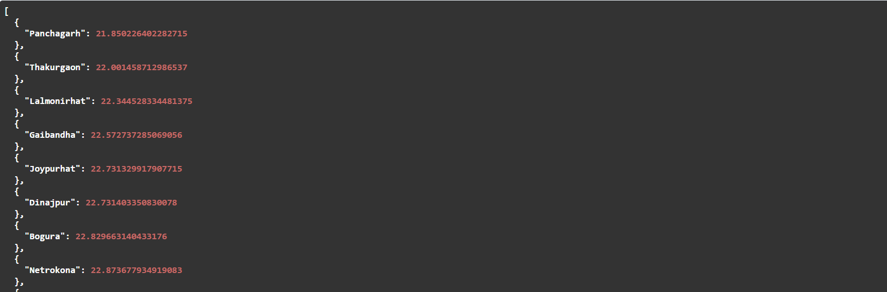
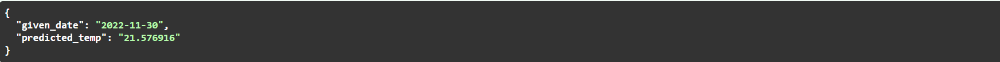

# WeatherWhisperer

## Overview

Welcome to WeatherWhisperer, your ultimate destination for weather information in cool districts worldwide! Our Cool Districts Weather API empowers users to explore destinations with delightful weather for their travel plans. Additionally, you can obtain temperature predictions for a specific date!

## Performance Note
- Please note that the initial response may take longer than 0.5 seconds due to the download time from the open-meteo API. Subsequent API calls return responses within 0.5 seconds.
- Additionally, be aware that the XGBoost library may take some time to download during the setup process.

## Getting Started

### Prerequisites

Ensure that Docker is installed on your machine. If not, you can download it [here](https://www.docker.com/get-started).

### Installation

1. Start the Docker service:

    ```bash
    sudo systemctl start docker
    ```

2. Build the Docker image from the root directory:

    ```bash
    docker build -t coolapi:v0 -f app/Dockerfile .
    ```

3. Start the Docker container:

    ```bash
    docker run -p 80:80 coolapi:v0
    ```

### Testing

- Open your browser and navigate to [http://localhost:80](http://localhost:80) to test the API.

- Open your browser and navigate to [http://localhost:80](http://localhost:80) to test the API.

- Successful response for getting the top 10 coolest district API should look like this : 


- Successful response for weather forecast of a given date should look like this : 


- Please use quotation marks and write the date in YYYY:MM:DD or DD:MM:YYYY format when giving input for weather forecast. 

### API Documentation

- Explore the API documentation by visiting [http://localhost:80/docs](http://localhost:80/docs).

## Troubleshooting

If you encounter any issues, Try any one of the following:

1. Prune Docker resources:

    ```bash
    sudo docker system prune
    ```

2. If you face the error "failed to solve: python:3.9.0: failed to authorize: failed to fetch anonymous token," restart or start the Docker service:

    ```bash
    sudo systemctl start docker
    # or
    sudo systemctl restart docker
    ```

## Contributing

If you would like to contribute to the development of the WeatherWhisperer API, please follow these guidelines:

1. Fork the repository.
2. Create a new branch for your feature: `git checkout -b feature-name`.
3. Commit your changes: `git commit -m 'Add some feature'`.
4. Push to the branch: `git push origin feature-name`.
5. Create a pull request.

## License

This project is licensed under the MIT License - see the [LICENSE](LICENSE) file for details.

Happy Traveling with WeatherWhisperer! 🌞🌍✈️